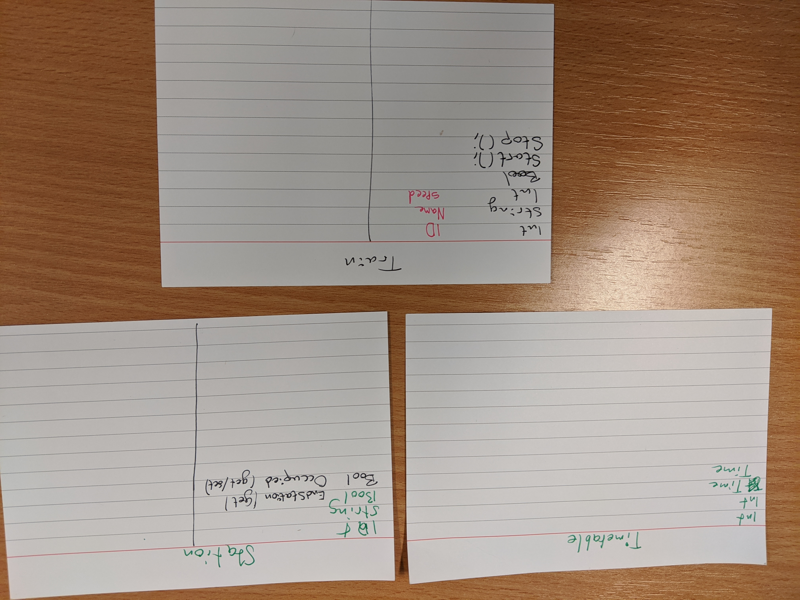
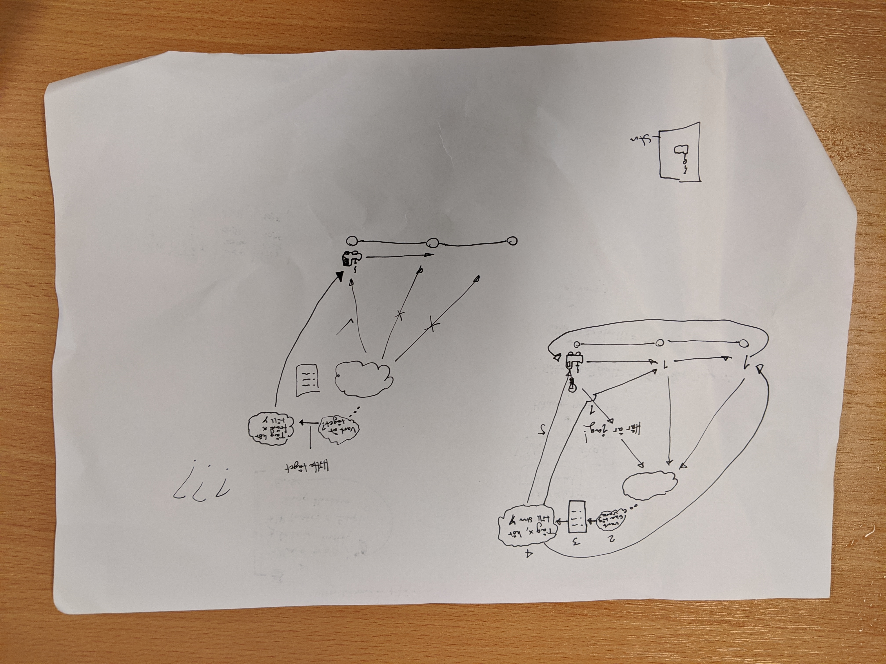
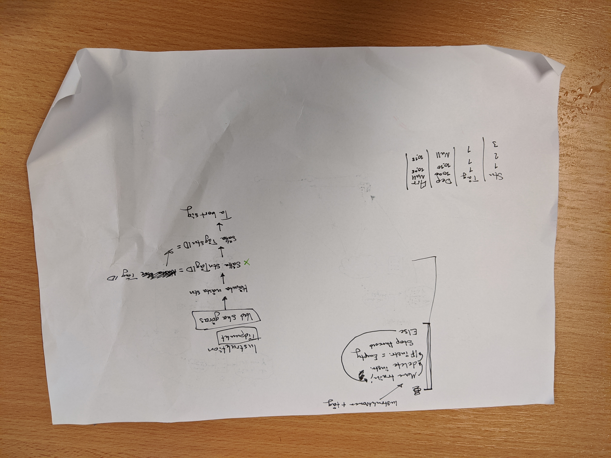
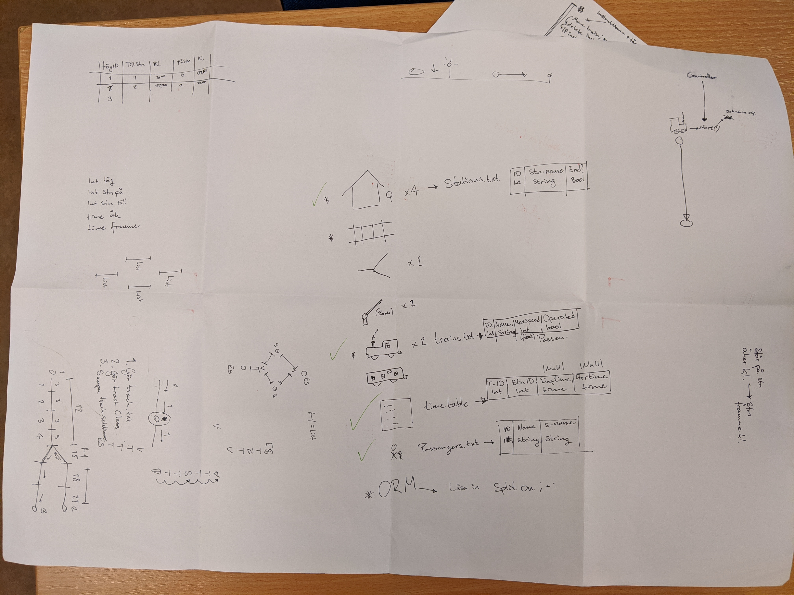

# Documentation
Class-responsibility-collaboration cards of Timetable, Station and Train

Ideas of how the train should operate by orders from the controller

Ideas of implementing a different table structure for Timetable and how to execute instruction

Overview of classes and properties

Overview of the train track 

